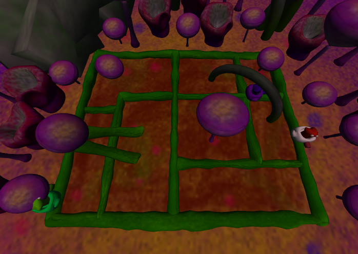
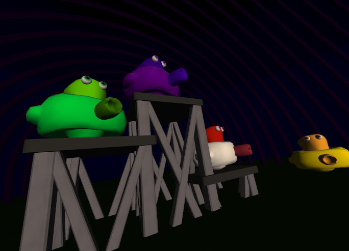
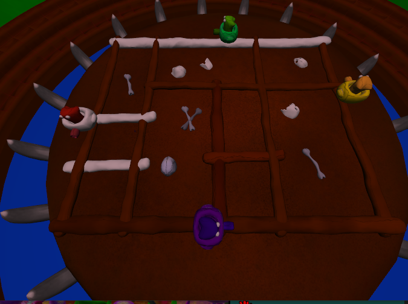
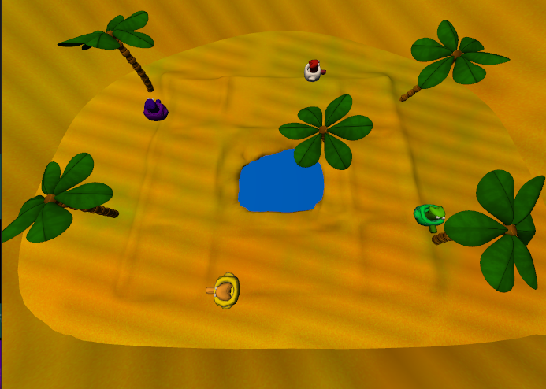
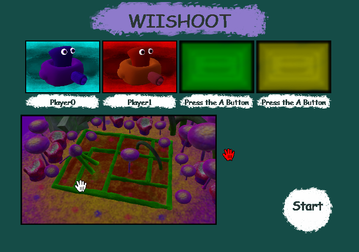
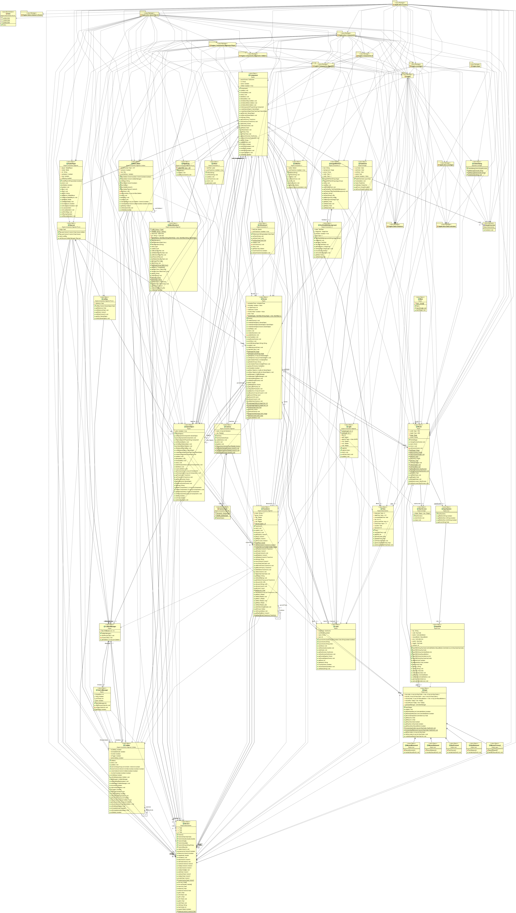

# WiiShoot 

This Project is a 3D local Multiplayer game, made in java.

- Motivation
- Description
- Why was this Project so complex? 
- Learnings
- External Tools

## Motivation

My Motivation, for this Project, was School.  In School I had to do a JavaFX Project in the Pos(programming) lessons. 
I decided to create a Game, this game.

I didn´t had to do such a complex Project like this, but i wanted.

## Description

The game Idea is pretty simple. You are a in a Cart. You can´t do much. The only things you can do are to shoot and decide if you wanna turn. You are constantly moving forward.  
The clue is you are not the only one. You have to survive or eliminate the other players.  
In order to eliminate a player, this player has to be hit at the back. 
If you are the last man standing, you win.

There are also Powerpus, they make you faster, for a few seconds.
There is also a simple Com and a Pause menu.

The Game has 3 Maps and a StartScreen. 
Every Map has it´s own theme and unique music.

Map1         |  Map2 |  Map3
:-------------------------:|:-------------------------:|:-------------------------:|
  |   |

In the StartScreen the Player can Press a to login. At this Process the Input devices are registered and the Player number. Also the map is selected.

The keyboard and DInput Controllers can be used, as Input devices.

## Why was this Project so complex?

It was so complex, because I didn't use many external tools.  
In order to structure the project and reuse the code later, I created my own little Game Engine on top of JavaFX.

I also created any 3D Model, Sound and most of the code by myself.

Anything in the Engine Package, is not directly related to my Project. It´s the Engine I created myself.

The first months of the Project went only in the Engine.  
The Engine concept is very similar to the one of Unity.  
You have a GameObject, which has just trivial behaviour.  The Components bring the behaviour. There are premade Components like the Camera, Lights, Collider and the MeshRenderer
  
But the game specific behaviour must be implemented by the developer.
The Game Engine can only import .obj files

Features of the Engine
- Import of 3D models
- Collision
- Input System
- Renderlayers(for example: 2D Layer on top of 3D)
- Sound System

the uml diagramm

## Learnings

In this Project I learned a lot. 
- I don't have to reinvent the wheel. Afterwards I think, it was not worth the effort. If I would have done this Project in Unity, the Project would have been doine in just a few days.
- JavaFX. This was my first big JavaFX Project.
- Improved 3D Modelling Skills
- Improved understanding of Game development.
- Define the Features at the beginning and stick to them. Don´t add them on the fly. During this Project I had new Ideas i wanted to add. This strechend the Projects development time. Things I wanted to implement and spend months on are for example a Online mode and a AI trained with reinforcment learning. The Online mode was just not finished at the end and the AI took way to long to train. At the end i spend Months for nothing.
- Assess the effort for creating a Project like this.
## External Tools
- JavaFX
- Import of the 3D Models: http://www.interactivemesh.org/models/jfx3dimporter.html
- Controller lib: https://github.com/williamahartman/Jamepad
